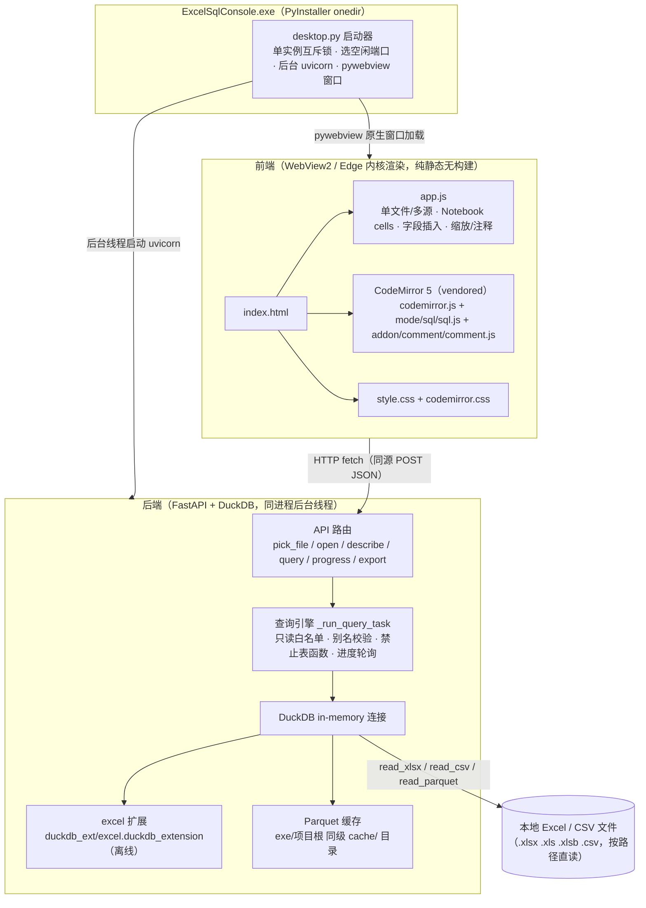

# Excel SQL 查询台 —— 整体架构

> 本地 Windows 桌面应用：`EXCEL → SQL 查询台`。按路径直读 Excel/CSV（不复制文件），
> 在 Notebook 里用 SQL 查询，支持单文件 / 多源关联两种模式。

## 一、架构总览（Mermaid）



## 二、组件职责

### 1. desktop.py —— 桌面启动器
- 单实例（Windows 命名互斥锁），二次打开只唤醒已有窗口。
- 选空闲端口，后台线程跑 `uvicorn` 启动 FastAPI。
- `_wait_until_ready` 探活后，用 **pywebview + WebView2（Edge 内核）** 弹原生窗口。
- monkey-patch EdgeChrome 注入降内存参数（`--disable-gpu`、`--renderer-process-limit=1` 等）。
- 窗口关闭 → 优雅停服务（shutdown 信号 + uvicorn 停止 + 线程回收）。

### 2. backend/app.py —— 后端（FastAPI + DuckDB）
- 静态托管 `frontend/`，同源部署（前端 `API_BASE=""`）。
- 关键接口：
  | 接口 | 作用 |
  |---|---|
  | `POST /api/pick_file` | tkinter 原生「选择文件」对话框（拿真实路径） |
  | `POST /api/open` | 返回字段 + 工作表列表（`SELECT * … LIMIT 0` 探测 schema） |
  | `POST /api/describe` | 多源模式批量读取 schema |
  | `POST /api/query` | 提交任务，立即返回 `task_id` |
  | `POST /api/progress` | 轮询进度 / 拿结果 |
  | `POST /api/export` | 导出结果（Excel/CSV，openpyxl） |
- 查询执行 `_run_query_task`（后台线程）：
  1. 新建内存 DuckDB 连接，`LOAD excel`（优先随包离线扩展）。
  2. 每个数据源注册成 `CREATE VIEW 别名 AS SELECT * FROM read_xlsx(...)`。
  3. 用户 SQL 包进视图再套 `LIMIT`（对行注释/块注释/分号健壮）。
  4. 进度线程持续采 `con.query_progress()` 写回真实百分比。
- 安全边界：别名保留字校验、只读语句白名单、禁止表函数（`read_xlsx`/`glob` 等）防路径绕过。

### 3. frontend/ —— 前端（纯静态，无构建）
- **单文件 / 多源** 模式切换；左栏数据源 + 字段 chips，右栏 Notebook。
- 每个 cell 用 **CodeMirror 5**（光标/文字/行号/高亮统一坐标系，彻底解决行号错位）。
- 编辑器能力：SQL 高亮、行号、Tab=4 空格、Ctrl+/ 注释、Ctrl+Enter 运行、Ctrl+滚轮缩放。
- 结果表格 + 导出按钮；进度条（准备阶段爬升 + 真实百分比接管）。

### 4. Parquet 查询缓存（本次新增）
- 首读 xlsx 时 `COPY (SELECT * FROM read_xlsx(...)) TO parquet`，后续直接 `read_parquet`。
- **缓存目录 = exe/项目根 同级的 `cache/` 目录**（不占用 C 盘系统目录；目录不可写时回退系统临时目录）。
- 缓存键 = `path + sheet + all_varchar + size + mtime`（stat 极快），文件改动自动失效。
- `count` 从「全表扫描」降为「读 parquet 行数元数据」，近毫秒级。
- 实测（30 万行）：冷读 1.07s → 热读 0.00s。

## 三、数据流（一次查询）

```
用户点「运行」
  → 前端读 CodeMirror 值（有选区只跑选区）
  → POST /api/query { sources, sql, limit }
  → 后端提交任务，返回 task_id
  → 前端轮询 POST /api/progress
       └ 后端线程：LOAD excel → 注册视图（命中 parquet 缓存则 read_parquet）
                    → CREATE VIEW q AS <sql> → SELECT * FROM q LIMIT n
                    → 进度轮询写回
  → status=done 返回 { columns, rows, row_count, elapsed_ms }
  → 前端渲染结果表格
```

## 四、目录结构

```
excel-sql-web/
├── desktop.py            # 桌面启动器（PyInstaller 入口）
├── build.py              # 打包脚本
├── packaging.spec        # onedir 打包配置
├── backend/
│   └── app.py            # FastAPI + DuckDB + parquet 缓存
├── frontend/             # 前端静态文件（源码 + 打包时进入 _internal）
│   ├── index.html
│   ├── style.css
│   ├── app.js
│   ├── codemirror.js / codemirror.css      # vendored CodeMirror 5
│   └── mode/sql/sql.js · addon/comment/comment.js
├── cache/                  # 运行时生成的 Parquet 缓存（首次查询后出现）
├── duckdb_ext/
│   └── excel.duckdb_extension              # 离线 excel 扩展
├── assets/                # 图标
└── dist/ExcelSqlConsole/  # 打包产物：exe + _internal/
```